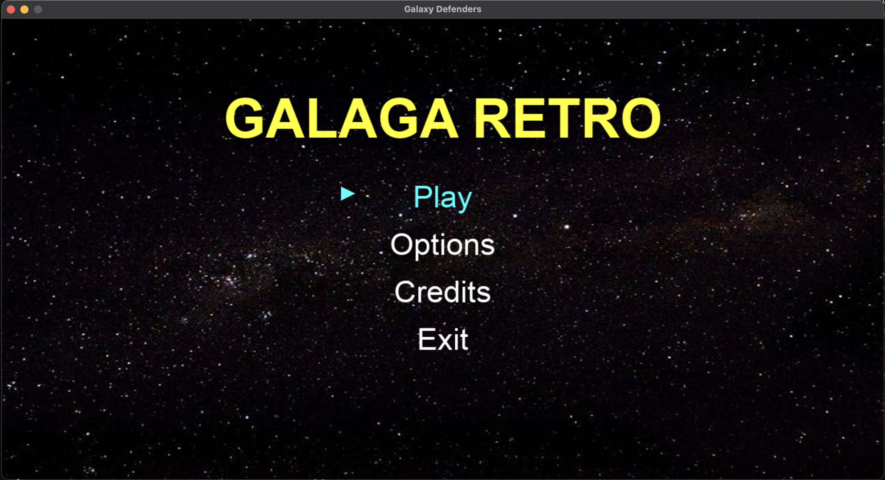

# Galaxy Defenders

A Pygame-based 2D space shooter game inspired by Galaga. Currently in early development with a fully functional menu system.

## UI Showcase



The game features a retro-style main menu with:
- **Cosmic Background**: Starfield background image
- **Bold Title**: "GALAGA RETRO" in bright yellow
- **Interactive Menu**: Navigate with arrow keys, highlighted selection in cyan
- **Audio**: Background music and sound effects

## Setup Instructions

### Prerequisites
- Python 3.6+
- pip

### Installation

1. **Check Python installation:**
   ```bash
   python3 --version
   ```

2. **Install pygame:**
   ```bash
   pip3 install pygame
   ```

   Or use a virtual environment (recommended):
   ```bash
   python3 -m venv venv
   source venv/bin/activate
   pip install pygame
   ```

3. **Run the game:**
   ```bash
   python3 main.py
   ```

## Controls

- **↑/↓ Arrow Keys**: Navigate menu
- **Enter**: Select option
- **Close Window**: Exit game

## Project Structure

```
Galaxy-Defenders/
├── main.py              # Main entry point
├── debug_menu.py        # Debug script
├── ui/
│   └── menu.py          # Menu implementation
└── assets/
    ├── images/          # Background images
    ├── music/           # Background music
    └── sounds/          # Sound effects
```

## Status

✅ Main menu system  
✅ Background music & sound effects  
⏳ Game scene (in development)  
⏳ Options menu (in development)  
⏳ Credits screen (in development)
